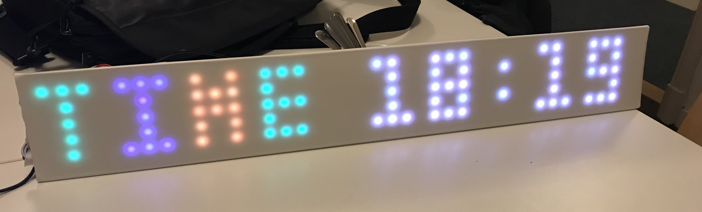

# Cheap Display
## Introduction
 This 39x5 matrix display consists of 5 strings of 39 WS2812B leds, of which the last one of each (minus the last) row is connected to the first one of the next row. A string of WS2812B leds is addressed with a sequential number in the range (1, number of WS2812B leds in the string). The basic addressing code is contained in the [`ws2812display.lua`](ws2812display.lua) file. A 3x5 font is available in [`tomthumbfont.lua`](tomthumbfont.lua) and a complete demonstration program is available in [`39x5-display.lua`](39x5-display.lua). This project is easily scalable, in that more leds per row, or more rows can be used.

The basic functionality is:
* Uses the 39x5 matrix as one display with plot(x,y) and print character functions;
* Gets the time from the internet, using Network Time Protocol;
* The actual time is shown, with 'TIME' in random-color;
* Get the last 5 records from ThingSpeak and round-robin shows them onscreen.

## Hardware
### Bill of materials
In order to re-create this display, the following parts are needed:
* A string of 39x5 = 195 WS2812B leds, preferably with 60 leds per meter (300 per 5 meter). You can order them from BangGood [here](https://www.banggood.com/AUDEW-1M4M5M-RGB-SMD5050-WS2812-300-LED-Flexible-Strip-Light-Addressable-Xmas-Party-Decor-DC5V-p-1101121.html?rmmds=search&ID=515211&cur_warehouse=CN) for about € 30,-. Note that there are many different type of RGB leds on the market, not all of them equal. Make sure to select a string of WS2812 with 60 leds per meter
* A NodeMCU
* A micro USB socket, in order to be able to power both the NodeMCU and the string of leds from one 5V power source, without damaging the NodeMCU
* A white sheet of perspex, about 3 mm thickness (a sheet of ordinary thin white paper works just as well, but looks less tidy)
* A sheet of PVC foam or carton
* A couple of meters of electric wire, to connect the end of one string of WS2812 leds to the next

## Software
### Required firmware modules
In order to run the demonstration program, the following modules are needed: `bit`, `file`, `gpio`, `http`, `net`, `node`, `rtctime`, `sjson`, `sntp`, `tmr`, `uart`, `wifi`, `ws2812`. A suitable firmware is available [here](nodemcu-13-modules-float.bin).
